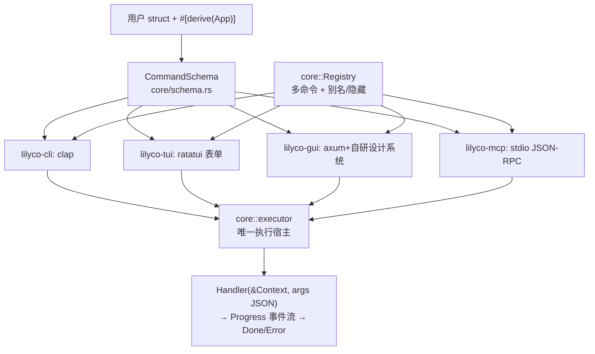

# Lilyco Codegraph — AI / Agent 代码图谱

> 给 AI Agent 和新贡献者的**唯一导航入口**。所有符号引用带 `文件:行号`，可直接跳转。
> **维护规则**：任何 PR 改动下述符号（新增/移动/改名/删除）必须同步更新本文件 —— 让图谱随代码漂移等于没有图谱。

## 0. 30 秒心智模型

**一个 struct 派生四个界面**：用户在业务 struct 上 `#[derive(App)]`，宏生成 `CommandSchema`（机器可读的命令描述），四个后端把同一份 schema 渲染成 CLI / TUI / Web / MCP，执行统一走 `core::executor`。



## 1. Workspace 依赖（严格单向，禁止反向）

| crate | 版本 | 依赖 | 职责一句话 |
|---|---|---|---|
| `lilyco-core` | 0.3.0 | serde/thiserror | 领域模型 + 执行语义 + 校验，零 UI 依赖 |
| `lilyco-macros` | 0.3.0 | syn/quote | `#[derive(App)]` / `#[derive(ValueEnum)]` 代码生成 |
| `lilyco-cli` | 0.3.0 | core + clap | schema → clap 渲染 + 内置标志 + 输出格式化 |
| `lilyco-tui` | 0.3.0 | core + ratatui | ratatui 表单状态机（单/多命令），不持有执行逻辑 |
| `lilyco-gui` | 0.3.0 | core + axum/tokio | Web 控制台 + SSE 进度 + 回环安全中间件 |
| `lilyco-mcp` | 0.3.0 | core（零额外依赖） | MCP 2024-11-05 stdio 服务器 + 进度通知 |
| `lilyco` | 0.2.3 | 全部 | **唯一组合根**：后端自动选择 + 各形态入口 |

Android/Termux：`lilyco --no-default-features` 剩 CLI+MCP（crossterm/axum 被特性门控）。

## 2. lilyco-core（领域核心）

| 符号 | 位置 | 说明 |
|---|---|---|
| `trait App` | `lilyco-core/src/app.rs:10` | `schema()` + `from_args()` + `run(&Context)`；宏自动实现 |
| `trait Renderer` | `lilyco-core/src/app.rs:22` | `render(&CommandSchema) -> Output`，各后端实现 |
| `struct CommandSchema` | `lilyco-core/src/schema.rs:40` | 命令的机器可读描述（四端渲染的唯一事实源） |
| `enum ArgKind` | `lilyco-core/src/schema.rs:21` | Flag/Text/Number{min,max}/Enum/Path{must_exist}/List |
| `validate_args()` | `lilyco-core/src/schema.rs:105` | **三端唯一参数校验实现**（required/range/enum/must_exist/List 递归） |
| `to_json_schema/openai/anthropic` | `lilyco-core/src/schema.rs:49,73,85` | AI tool 定义导出 |
| `type Handler` | `lilyco-core/src/registry.rs:23` | `Arc<dyn Fn(&Context, &Value) -> Result<Value, AppError>>` |
| `struct Registry` | `lilyco-core/src/registry.rs` | 多命令注册表；`register:148` `get(含别名):163` `visible:180` `from_json:194` `with_policy`（**必须在 `register` 之前调用**：门在注册时包住 handler） |
| `RegisteredCommand::from_app` | `lilyco-core/src/registry.rs:92` | App 类型 → 注册表条目（零样板入口） |
| `spawn()` / `execute()` | `lilyco-core/src/executor.rs:35,92` | **唯一执行宿主**：后台线程 + 进度 channel |
| `struct Task` | `lilyco-core/src/executor.rs:20` | `cancel` + `rx` + `handle` |
| `enum Progress` | `lilyco-core/src/progress.rs:10` | Started/Tick/Log/Done/Error，serde tag=`type` |
| `Context` | `lilyco-core/src/context.rs` | handler 上报进度：`emit:71` `tick:81` `log:92` `done:100` `is_cancelled:76` |
| `trait HostBridge` | `lilyco-core/src/context.rs` | handler 反向调用宿主的唯一接口：`ctx.sample()`（MCP sampling/createMessage）/ `ctx.roots()`；CLI/TUI/GUI 不接桥，返回带指引错误 |
| `enum AppError` | `lilyco-core/src/error.rs` | InvalidArg/InvalidInput/Runtime/Cancelled |

## 3. 四个后端

### lilyco-cli（`lilyco-cli/src/`，按职责分文件；对外只有 `CliRenderer` / `run` / `run_registry` / `build_registry_command`）
| 符号 | 位置 | 说明 |
|---|---|---|
| `struct CliRenderer` | `renderer.rs:27` | schema → clap 的渲染入口；`handle_builtin_flags():46`、`output_format():90`、`extract_args():103` |
| `run::<A>()` | `single.rs:17` | 单命令一行启动（clap 校验 → extract → executor → drain） |
| `run_registry()` | `registry.rs:28` | **多命令**：Registry → clap 子命令树；根级 `--schema` 打印清单 |
| `build_registry_command()` | `registry.rs:55` | 纯函数构建根 Command（别名/隐藏→hide(true)） |
| `resolve_registry_command()` | `registry.rs:82` | 规范名/别名 → 注册表条目（含 schema.name 兜底） |
| `drain_events()` | `registry.rs:114` | 单/多命令共用的进度消费（Human/Json/JsonStream） |
| `build_command()` / `add_builtin_flags()` | `command.rs:17` / `command.rs:133` | 构造规则本体：一个 `ArgKind` 怎么变成 `clap::Arg` |

### lilyco-tui（状态机，三文件）
| 符号 | 位置 | 说明 |
|---|---|---|
| `enum AppState` | `lilyco-tui/src/renderer.rs:43` | CommandSelect → Form → Confirm → Running → Done/Error |
| `struct TuiApp` | `lilyco-tui/src/app.rs:13` | `new():31` 单命令；`new_multi():46` 多命令（mininterface picker 模式） |
| `handle_event()` | `lilyco-tui/src/app.rs:81` | 按状态分发；Done/Error 后多命令回选择页 |
| `struct FormRenderer` | `lilyco-tui/src/renderer.rs:14` | `validation_errors():131`（提交前校验）、`cli_preview():98` |
| `struct FormField` | `lilyco-tui/src/widgets.rs:73` | 携带 `ArgKind` 约束；`validate():99` 与 core validate_args 同语义 |
| `render_command_select()` | `lilyco-tui/src/renderer.rs:238` | 多命令选择页（↑↓/jk + Enter） |
| `path_complete()` | `lilyco-tui/src/app.rs` | Path 字段 Tab 目录补全（readline 风格循环候选；`split_dir_prefix` 兼容 `/` 与 `\`） |

### lilyco-gui（`lilyco-gui/src/`，按职责分文件；对外只有 `GuiRenderer` / `RunnerFn` / `TOKEN_HEADER`）
| 符号 | 位置 | 说明 |
|---|---|---|
| `serve_app::<A>()` | `lib.rs:158` | 单命令：**内部建单命令注册表**再走 `serve_registry`（只有那条路登记取消句柄，见 DESIGN.md §8.6）；`serve(schema, runner):78` 是给自定义 runner 的逃生口（页面据此不画「取消」） |
| `serve_registry()` | `lib.rs:94` | **多命令**；`GET /?cmd=xxx` 渲染对应表单 + 下拉切换 |
| `serve_state()` | `lib.rs:113` | 路由器装配处：六个端点 + `security_mw` 一道闸（**新增端点只改这里**） |
| `security_mw()` | `security.rs:63` | 回环 Host 校验 + Origin 校验 + 随机 Token（防 DNS rebinding/CSRF）；`PROTECTED_POST:21` 是那份端点清单 |
| `AppState` | `state.rs:17` | schema / registry / sessions / cancels / token 一处真相（`pub(crate)`，测试夹具在同文件 `fixture`） |
| `pick_command()` | `render.rs:32` | `?cmd=` → 可见命令（别名命中；隐藏回退第一个可见） |
| `index()` | `render.rs:44` | 只做装配：取 schema → 拼组件 → 填模板 → 挂响应头（含 `no-store`，见 DESIGN.md §8.4） |
| `render_field()` | `render.rs:122` | **一个 `ArgKind` 一个组件函数**（`widget_flag/text/number/enum/path/list` + `field_shell`/`dropzone`/`pick_button`/`list_row`/`command_nav`），转义在 `Field` 里算一次 |
| 前端组件装配 | `assets/index.html` | 一个组件一个 `init*` + 末尾一行 `BOOT`；`initDropzone` 负责拖拽区里三个控件的点击分流 |
| 设计令牌与组件目录 | `lilyco-gui/DESIGN.md` | §1–§6 颜色/间距/排版/圆角/动效/响应式的**唯一一张表**（`app.css` 只许引用表里的值），§7 DOM 契约，§10 每个组件的构成/七态/令牌/无障碍 |
| `run_handler()` | `run.rs:88` | `/run`：多命令按 `req.cmd` 显式分发（未知/隐藏 → 400，**绝不静默换命令**）；单命令 runner 模式直接 spawn 调用方的 `RunnerFn` |
| `run_progress()` | `run.rs:45` | 唯一会登记取消句柄的执行循环：handler → `executor::spawn` → SSE 事件转发 → 终态清理 `cancels`（`/cancel` 只找得到这条路上的会话） |
| `upload_handler()` | `files.rs:98` | 拖拽上传 → base64 → 服务端临时副本（净化文件名 + 双重体积上限） |
| `pick_handler()` | `files.rs:201` | 本机原生选择器 → 回填**原始路径**（`pick` 特性；`flash_picker_when_ready:160` 治前台锁定） |

### lilyco-mcp（`lilyco-mcp/src/`；对外只有 `McpServer` + 协议常量）
| 符号 | 位置 | 说明 |
|---|---|---|
| `handle_line()` | `server.rs:35` | 纯函数：一行请求 → 一行响应（通知返回 None） |
| `handle_line_with_sink()` | `server.rs:44` | 流式版：进度通知逐行回调 |
| `tools_call()` | `server.rs:238` | 先 `validate_args`（错误 → INVALID_PARAMS），带 `_meta.progressToken` 时 spawn 流式执行 → `notifications/progress` |
| `serve()` / `serve_stdio()` | `server.rs:101` / `server.rs:208` | 双向 JSON-RPC 分流：客户端请求→dispatch（tools/call 进 worker 线程），客户端响应→pending 表路由给等待中的 handler |
| `protocol.rs` | `progress_notification():14`、`initialize_response():37` | JSON-RPC 报文装配与协议常量（线格式只在这一层） |
| `McpBridge` | `bridge.rs:37` | HostBridge 实现：`sampling/createMessage` / `roots/list` 反向请求；`srv-N` 字符串 id 防冲突；initialize 探测客户端能力门控 |

## 4. facade `lilyco`（唯一组合根，`lilyco/src/lib.rs`）

| 符号 | 行 | 说明 |
|---|---|---|
| `detect_backend()` | 122 | `--mcp/--gui` > `LILYCO_UI` > 终端探测（TUI 失败回退 CLI） |
| `run::<A>()` / `run_with()` | 165 / 170 | 单命令四端自动选择 |
| `serve_mcp()` | 189 | 注册表 → MCP 服务器 |
| `run_cli_registry()` | 206 | 注册表 → clap 子命令 |
| `run_tui_registry()` | 220 | 注册表 → TUI 命令选择页（起不来回退 CLI 多命令） |
| `run_web_registry()` | 243 | 注册表 → Web 控制台（`?cmd=` 下拉 + `/run` 显式分发） |
| `run_registry()` | 282 | **多命令一行启动**：按 `detect_registry_backend()` 自动分发 |
| `run_registry_with()` | 300 | 显式指定后端；**按调用面注入 SafetyPolicy**（MCP→`DenyElevated`，其余→`Interactive`） |
| `run_registry_with_policy()` | 315 | 调用方自带策略（逃生舱，业务通常不要用） |
| `detect_registry_backend()` | 392 | 多命令形态探测：**自动探测出的 TUI 降级为 CLI**（裸跑不该被拽进交互界面；进 TUI 须显式 `--tui`） |
| `build_multi_tui()` | 488 | 纯函数：注册表 →（选择页 TuiApp + 名字→handler 表）。与事件循环分离以便无 TTY 单测（隐藏命令过滤、空注册表报错） |
| `into_registry_with_policy()` | 342 | 对已有注册表重建以换策略（**兜底**：只能替换，不能解开已包在 handler 上的旧门） |
| `run_tui_event_loop()` | 515 | 单/多命令共享的 TUI 循环（非阻塞 drain + 可取消） |

## 5. 多命令语义对照（四端对齐）

| 语义 | CLI | TUI | Web GUI | MCP |
|---|---|---|---|---|
| 可见命令 | 子命令 + help | 选择页列表 | `?cmd=` + 下拉 | tools/list |
| 别名 | clap alias + registry 解析 | —（列表不显示） | `registry.get` 命中 | `registry.get` 命中 |
| 隐藏命令 | 可调用，help 不显示 | 不可见 | 不可导航；`/run` 显式调用 → 400 | get 可命中，tools/list 不显示 |
| 参数校验 | clap（解析层） | `FormField::validate`（提交前，同语义） | `validate_args`（服务端 400）+ HTML5 | `validate_args`（INVALID_PARAMS） |
| 进度 | stdout / json-stream | 非阻塞 drain | SSE | `notifications/progress`（带 token 时） |

## 6. 不变量（改代码前必读）

1. **executor 是唯一执行宿主**：任何"线程 + channel + 进度消费"的新实现都是重复 —— 加后端 = 渲染层 + 一处 `spawn` 调用。
2. **`CommandSchema::validate_args` 是唯一校验实现**：TUI `FormField::validate` 是其表单侧映射；新增校验规则先改 core，再同步 TUI。
3. **事件流协议**：`rx` 恒以 `Done`/`Error` 结尾（`executor::spawn` 合成兜底）——消费者无需自己兜底。
4. **依赖单向**：core 不依赖后端，后端互不依赖，facade 是唯一知道所有后端的 crate。
5. **clap 只接受 `'static str`**：运行时字符串用 `leak_str`（`lilyco-cli/src/command.rs:13`，Box::leak，进程内无累积问题）。
6. **导航可回退、执行不可回退**：`index` 的 `?cmd` 未知时回退第一个可见命令；`/run` 显式指定未知命令必须 400。
7. **宏展开引用 `::lilyco::__core::`（facade doc-hidden 再导出）**：用户只需依赖 `lilyco` 一个 crate；直接使用 `lilyco-macros` 的项目须同时依赖 `lilyco`（macros 的 dev-deps 即此契约）。
8. **安全策略按「调用面」注入，且在 `register` 之前**：`Registry::with_policy` 在注册时就把 handler 包进门，所以顺序不能反；`run_registry_with` 按后端选策略 —— **MCP = `DenyElevated`（自动化面，fail-closed）**，**CLI/TUI/Web = `Interactive`（人类在环，放行 T1）**。这是四端"同一份 handler、不同信任级别"的唯一实现点。`into_registry_with_policy` 只能用于**尚未注册**的注册表；对已注册的调它会在 handler 上叠第二道门（旧门先拒），表现为"换了策略还是被拒"。
9. **MCP `serve()` 在 stdin EOF 后必须 join 在途 worker**：`tools/call` 丢到 worker 线程执行（为支持 handler 反向 `sampling/createMessage`），短连接客户端（脚本 / `echo … | server`）写完即关 stdin —— 不等 worker 就会丢响应。回归测试：`serve_waits_for_inflight_tools_call_on_eof`。

## 7. 扩展点（怎么加东西）

- **加一个命令**：写 struct + `#[derive(App)]`（可选 `#[app(name/about/run/safety/crate)]`，字段 doc comment 即描述）→ `registry.register(RegisteredCommand::from_app::<T>())`。四端自动获得。
  `crate = "lilyco_core"` 是给**不依赖 facade** 的嵌入方用的：默认展开成 `::lilyco::__core::…`，
  两条路径下的条目一一对应（facade 里就是 `pub use lilyco_core as __core`）。
- **加一个域二进制**：照 `lilyco-files`（文件域）或 `lilyco-binfmt`（办公文件与容器结构域，`lbin`，12 条全 T0 只读）抄 `main.rs` 的 registry 装配 + 按调用面注入安全策略 → 根 `Cargo.toml` 的 `[workspace] members` 加一行 → 使用文档放 `docs/<域>.md`（`docs/lfiles.md`、`docs/binfmt.md`）。
  **完整清单（12 步，含 CI 枚举那一步）与可复制骨架见 [INTEGRATION.md](INTEGRATION.md) + `scripts/domain-template/`。**
  应用 crate 只依赖 `lilyco` 一个包：core 的类型（`Context` / `SafetyPolicy` / `SafetyTier` / `Registry`…）从 `lilyco::prelude::*` 拿，
  `derive(App)` 默认展开成 `::lilyco::__core::…` —— 不需要把 `lilyco-core` 写进 `[dependencies]`（`lbin` 已按这条清掉）。
- **加一个后端**：新 crate 只依赖 core，实现 `Renderer`；facade 加一行分发。参考 lilyco-mcp（最小样板 ≈ 350 行含测试）。
- **选后端 = 开特性，但只有一处该开**：`lilyco-core` **没有任何特性**（它是后端无关的领域层）；
  域 crate 一律 `default = ["full"]` / `full = ["dep:lilyco", "lilyco/full"]` / `android = ["dep:lilyco"]`；
  facade `default = []` + `full = ["tui","web","ultra"]`（后端各自 `dep:` 门控）；
  `lilyco-gui` 的 `pick` 只管它自己的原生文件选择器。
  新增域 crate 照这套命名，别再造 `headless` / `no-tui` / `cli` 这类同义词（core 原来那三个空壳特性就是这么来的，已删）。
- **加校验规则**：`schema.rs::validate_kind` + `schema.rs` 测试 + TUI `FormField::validate` 映射 + README 限制清单。
- **加进度事件**：`Progress` 枚举加变体（serde 兼容）→ 各后端消费者各加一臂。

## 8. 常用命令

```bash
cargo test --workspace            # 全量测试（233+）
cargo fmt --all && cargo clippy --workspace --all-targets
cargo run -p lilyco-example --example multi -- ping --name 世界   # 多命令冒烟
cargo run -p lilyco-example --example multi -- --schema           # 注册表清单
cargo run -p lilyco-example -- --mcp                              # MCP 服务器冒烟
cargo bench -p lilyco-example                      # schema 生成性能基准
```

发版：改各 crate 版本（本文件 §1 同步更新）→ commit → `bash scripts/publish.sh`（按依赖顺序全链发布；脚本用临时 CARGO_HOME 绕开 rsproxy 镜像滞后，验证构建走 crates.io 真实索引）。

## 9. 测试地图

| 区域 | 位置 | 覆盖 |
|---|---|---|
| core 校验/协议/registry | `lilyco-core/src/{schema,lib,registry}.rs` `#[cfg(test)]` | validate_args 12 例、Progress serde、registry 别名/隐藏/JSON |
| CLI | `lilyco-cli/src/tests.rs` | 渲染/解析/内置标志/多命令构建与解析（31 例） |
| TUI | `lilyco-tui/src/lib.rs` 底部 | 渲染、状态机、校验拦截、多命令选择页、路径 Tab 补全 |
| GUI | `lilyco-gui/src/{security,state,render,run,files,util}.rs` 各自底部 | run_handler 400/200、pick_command、?cmd 导航、转义、base64、文件名净化、`/pick` 同闸；**取消链**：registry 跑起来会登记句柄且终态清掉、runner 模式 `/cancel` 必 404；**组件契约**：六种 ArgKind 各自出组件且 `data-component` 自报、`List` 的行控件跟着 item 类型、JS 里每个 `init*` 都在 `BOOT`、装配行在脚本末尾（TDZ）、内联 JS 过 `node --check`、页面无内联事件、每个 `data-*` 都有人读、拖拽区 id 对得上 JS 的拼法、`no-store`、单边区间也要写进提示、`app.css` 的颜色字面量全在 DESIGN.md §1 那张表里、资源体积守 DESIGN.md §9 的上限、reduced-motion 下进度与 loading 留了静态替代 |
| MCP | `lilyco-mcp/src/tests.rs` | initialize/tools/进度通知/双向 serve/校验拒绝（26 例） |
| 门面 | `lilyco/src/lib.rs` 底部 | 后端探测 |
| 办公文件（同一个域） | `lilyco-binfmt/src/{zipread,xmlscan,cfb,props,rtf,word,biff,opack}.rs` 与 `{office_info,office_text,office_meta,office_doc,office_sheet,office_slide,office_package,office_objects}.rs` 底部 + `tests/fixtures/office/` | 解压必须过部件自报的 CRC-32；容器识别看部件名/流名不看后缀；OPC 关系按源部件目录解析、断头关系要报；`[Content_Types].xml` 的 Default 与 Override 两种声明都要认；CFB 链成环/越界就地截断并留话；MS-OPS 的属性集个数在偏移 24 不是 28、`VT_LPSTR` 按文件自报的 CodePage 解、VT_I2 按无符号读；RTF 控制字按词边界结束、`\*` 群整群跳过、`\uN` 按 `\ucN` 丢等价回退字符且 `\'hh` 只算一个；`.doc` piece 的压缩位（fc 除二 + cp1252）；BIFF8 的 SST 跨 CONTINUE 要重读 grbit、RK 的 bit0=除 100 / bit1=整数、BOUNDSHEET 可见性在 grbit 最低两位、格子的主人看 lbPlyPos（Workbook 流内字节偏移）而不是数 BOF 的次序；`--limit 0` 回退缺省而 `--max-bytes 0` 是不设上限（两种 0 不能混）；13 份 fixture 全由独立生产者写，期望值来自 `scripts/acceptance/office_reader.py`，CI 里 `office_probe.py` 与它逐字段对账 |
| 域二进制 | `lilyco-binfmt/src/{main,read,entries,regions,symbols}.rs` 底部 | 注册表形状/全 T0/工具导出/参数拒绝；魔数判别（Java class ≠ 通用二进制）、tar 八位校验和、PNG 真算 CRC、ELF 头部只到 `e_ehsize`、Mach-O 端序与定长 16 字节节名、零填充节不画成数据 |
| 端到端 | `lilyco-example/tests/integration.rs` + `examples/multi.rs` | 图片压缩全链路 + 多命令演示 |
| 性能基准 | `lilyco-example/benches/schema.rs` | schema 生成 / 导出 / 校验 / Registry 装配（`cargo bench -p lilyco-example`） |
