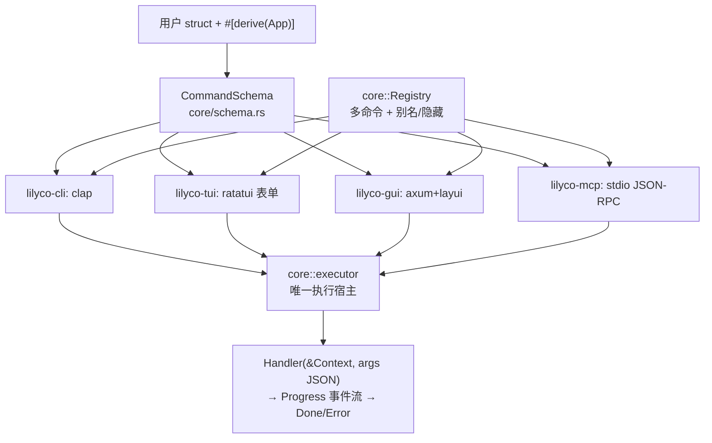

# Lilyco Codegraph — AI / Agent 代码图谱

> 给 AI Agent 和新贡献者的**唯一导航入口**。所有符号引用带 `文件:行号`，可直接跳转。
> **维护规则**：任何 PR 改动下述符号（新增/移动/改名/删除）必须同步更新本文件 —— 让图谱随代码漂移等于没有图谱。

## 0. 30 秒心智模型

**一个 struct 派生四个界面**：用户在业务 struct 上 `#[derive(App)]`，宏生成 `CommandSchema`（机器可读的命令描述），四个后端把同一份 schema 渲染成 CLI / TUI / Web / MCP，执行统一走 `core::executor`。



## 1. Workspace 依赖（严格单向，禁止反向）

| crate | 版本 | 依赖 | 职责一句话 |
|---|---|---|---|
| `lilyco-core` | 0.2.3 | serde/thiserror | 领域模型 + 执行语义 + 校验，零 UI 依赖 |
| `lilyco-macros` | 0.2.2 | syn/quote | `#[derive(App)]` / `#[derive(ValueEnum)]` 代码生成 |
| `lilyco-cli` | 0.2.2 | core + clap | schema → clap 渲染 + 内置标志 + 输出格式化 |
| `lilyco-tui` | 0.2.4 | core + ratatui | ratatui 表单状态机（单/多命令），不持有执行逻辑 |
| `lilyco-gui` | 0.2.3 | core + axum/tokio | Web 控制台 + SSE 进度 + 回环安全中间件 |
| `lilyco-mcp` | 0.2.3 | core（零额外依赖） | MCP 2024-11-05 stdio 服务器 + 进度通知 |
| `lilyco` | 0.2.2 | 全部 | **唯一组合根**：后端自动选择 + 各形态入口 |

Android/Termux：`lilyco --no-default-features` 剩 CLI+MCP（crossterm/axum 被特性门控）。

## 2. lilyco-core（领域核心）

| 符号 | 位置 | 说明 |
|---|---|---|
| `trait App` | `lilyco-core/src/app.rs:10` | `schema()` + `from_args()` + `run(&Context)`；宏自动实现 |
| `trait Renderer` | `lilyco-core/src/app.rs:22` | `render(&CommandSchema) -> Output`，各后端实现 |
| `struct CommandSchema` | `lilyco-core/src/schema.rs:40` | 命令的机器可读描述（四端渲染的唯一事实源） |
| `enum ArgKind` | `lilyco-core/src/schema.rs:21` | Flag/Text/Number{min,max}/Enum/Path{must_exist}/List |
| `validate_args()` | `lilyco-core/src/schema.rs:105` | **三端唯一参数校验实现**（required/range/enum/must_exist/List 递归） |
| `to_json_schema/openai/anthropic` | `lilyco-core/src/schema.rs:49,73,85` | AI tool 定义导出 |
| `type Handler` | `lilyco-core/src/registry.rs:23` | `Arc<dyn Fn(&Context, &Value) -> Result<Value, AppError>>` |
| `struct Registry` | `lilyco-core/src/registry.rs` | 多命令注册表；`register:148` `get(含别名):163` `visible:180` `from_json:194` |
| `RegisteredCommand::from_app` | `lilyco-core/src/registry.rs:92` | App 类型 → 注册表条目（零样板入口） |
| `spawn()` / `execute()` | `lilyco-core/src/executor.rs:35,92` | **唯一执行宿主**：后台线程 + 进度 channel |
| `struct Task` | `lilyco-core/src/executor.rs:20` | `cancel` + `rx` + `handle` |
| `enum Progress` | `lilyco-core/src/progress.rs:10` | Started/Tick/Log/Done/Error，serde tag=`type` |
| `Context` | `lilyco-core/src/context.rs` | handler 上报进度：`emit:71` `tick:81` `log:92` `done:100` `is_cancelled:76` |
| `trait HostBridge` | `lilyco-core/src/context.rs` | handler 反向调用宿主的唯一接口：`ctx.sample()`（MCP sampling/createMessage）/ `ctx.roots()`；CLI/TUI/GUI 不接桥，返回带指引错误 |
| `enum AppError` | `lilyco-core/src/error.rs` | InvalidArg/InvalidInput/Runtime/Cancelled |

## 3. 四个后端

### lilyco-cli（`lilyco-cli/src/lib.rs`）
| 符号 | 行 | 说明 |
|---|---|---|
| `run::<A>()` | 146 | 单命令一行启动（clap 校验 → extract → executor → drain） |
| `run_registry()` | 195 | **多命令**：Registry → clap 子命令树；根级 `--schema` 打印清单 |
| `build_registry_command()` | 222 | 纯函数构建根 Command（别名/隐藏→hide(true)） |
| `resolve_registry_command()` | 249 | 规范名/别名 → 注册表条目（含 schema.name 兜底） |
| `drain_events()` | 281 | 单/多命令共用的进度消费（Human/Json/JsonStream） |

### lilyco-tui（状态机，三文件）
| 符号 | 位置 | 说明 |
|---|---|---|
| `enum AppState` | `lilyco-tui/src/renderer.rs:43` | CommandSelect → Form → Confirm → Running → Done/Error |
| `struct TuiApp` | `lilyco-tui/src/app.rs:13` | `new():31` 单命令；`new_multi():46` 多命令（mininterface picker 模式） |
| `handle_event()` | `lilyco-tui/src/app.rs:81` | 按状态分发；Done/Error 后多命令回选择页 |
| `struct FormRenderer` | `lilyco-tui/src/renderer.rs:14` | `validation_errors():131`（提交前校验）、`cli_preview():98` |
| `struct FormField` | `lilyco-tui/src/widgets.rs:73` | 携带 `ArgKind` 约束；`validate():99` 与 core validate_args 同语义 |
| `render_command_select()` | `lilyco-tui/src/renderer.rs:238` | 多命令选择页（↑↓/jk + Enter） |
| `path_complete()` | `lilyco-tui/src/app.rs` | Path 字段 Tab 目录补全（readline 风格循环候选；`split_dir_prefix` 兼容 `/` 与 `\`） |

### lilyco-gui（`lilyco-gui/src/lib.rs`）
| 符号 | 行 | 说明 |
|---|---|---|
| `serve_app::<A>()` | 164 | 单命令；`serve(schema, runner):99` 底层 |
| `serve_registry()` | 114 | **多命令**；`GET /?cmd=xxx` 渲染对应表单 + 下拉切换 |
| `pick_command()` | 266 | `?cmd=` → 可见命令（别名命中；隐藏回退第一个可见） |
| `run_handler()` | 532 | `/run`：多命令按 `req.cmd` 显式分发（未知/隐藏 → 400，**绝不静默换命令**）；单命令走 `runner` |
| `run_progress()` | 189 | handler → spawn → SSE 事件转发（单/多命令共用） |
| `security_mw()` | 232 | 回环 Host 校验 + Origin 校验 + 随机 Token（防 DNS rebinding/CSRF） |

### lilyco-mcp（`lilyco-mcp/src/lib.rs`）
| 符号 | 行 | 说明 |
|---|---|---|
| `handle_line()` | 54 | 纯函数：一行请求 → 一行响应（通知返回 None） |
| `handle_line_with_sink()` | 63 | 流式版：进度通知逐行回调 |
| `tools_call()` | 155 | 先 `validate_args`（错误 → INVALID_PARAMS），带 `_meta.progressToken` 时 spawn 流式执行 → `notifications/progress` |
| `serve()` / `serve_stdio()` | 105 / 132 | 双向 JSON-RPC 分流：客户端请求→dispatch（tools/call 进 worker 线程），客户端响应→pending 表路由给等待中的 handler |
| `McpBridge` | `lilyco-mcp/src/lib.rs` | HostBridge 实现：`sampling/createMessage` / `roots/list` 反向请求；`srv-N` 字符串 id 防冲突；initialize 探测客户端能力门控 |

## 4. facade `lilyco`（唯一组合根，`lilyco/src/lib.rs`）

| 符号 | 行 | 说明 |
|---|---|---|
| `detect_backend()` | 95 | `--mcp/--gui` > `LILYCO_UI` > 终端探测（TUI 失败回退 CLI） |
| `run::<A>()` / `run_with()` | 136 / 141 | 单命令四端自动选择 |
| `serve_mcp()` | 158 | 注册表 → MCP 服务器 |
| `run_cli_registry()` | 175 | 注册表 → clap 子命令 |
| `run_tui_registry()` | 189 | 注册表 → TUI 命令选择页（起不来回退 CLI 多命令） |
| `run_tui_event_loop()` | 263 | 单/多命令共享的 TUI 循环（非阻塞 drain + 可取消） |

## 5. 多命令语义对照（四端对齐）

| 语义 | CLI | TUI | Web GUI | MCP |
|---|---|---|---|---|
| 可见命令 | 子命令 + help | 选择页列表 | `?cmd=` + 下拉 | tools/list |
| 别名 | clap alias + registry 解析 | —（列表不显示） | `registry.get` 命中 | `registry.get` 命中 |
| 隐藏命令 | 可调用，help 不显示 | 不可见 | 不可导航；`/run` 显式调用 → 400 | get 可命中，tools/list 不显示 |
| 参数校验 | clap（解析层） | `FormField::validate`（提交前，同语义） | `validate_args`（服务端 400）+ HTML5 | `validate_args`（INVALID_PARAMS） |
| 进度 | stdout / json-stream | 非阻塞 drain | SSE | `notifications/progress`（带 token 时） |

## 6. 不变量（改代码前必读）

1. **executor 是唯一执行宿主**：任何"线程 + channel + 进度消费"的新实现都是重复 —— 加后端 = 渲染层 + 一处 `spawn` 调用。
2. **`CommandSchema::validate_args` 是唯一校验实现**：TUI `FormField::validate` 是其表单侧映射；新增校验规则先改 core，再同步 TUI。
3. **事件流协议**：`rx` 恒以 `Done`/`Error` 结尾（`executor::spawn` 合成兜底）——消费者无需自己兜底。
4. **依赖单向**：core 不依赖后端，后端互不依赖，facade 是唯一知道所有后端的 crate。
5. **clap 只接受 `'static str`**：运行时字符串用 `leak_str`（`lilyco-cli/src/lib.rs:353`，Box::leak，进程内无累积问题）。
6. **导航可回退、执行不可回退**：`index` 的 `?cmd` 未知时回退第一个可见命令；`/run` 显式指定未知命令必须 400。
7. **宏展开引用 `lilyco_core::` 绝对路径**：用户二进制必须同时依赖 `lilyco-core`。

## 7. 扩展点（怎么加东西）

- **加一个命令**：写 struct + `#[derive(App)]`（可选 `#[app(name/about/run)]`，字段 doc comment 即描述）→ `registry.register(RegisteredCommand::from_app::<T>())`。四端自动获得。
- **加一个后端**：新 crate 只依赖 core，实现 `Renderer`；facade 加一行分发。参考 lilyco-mcp（最小样板 ≈ 350 行含测试）。
- **加校验规则**：`schema.rs::validate_kind` + `schema.rs` 测试 + TUI `FormField::validate` 映射 + README 限制清单。
- **加进度事件**：`Progress` 枚举加变体（serde 兼容）→ 各后端消费者各加一臂。

## 8. 常用命令

```bash
cargo test --workspace            # 全量测试（233+）
cargo fmt --all && cargo clippy --workspace --all-targets
cargo run -p lilyco-example --example multi -- ping --name 世界   # 多命令冒烟
cargo run -p lilyco-example --example multi -- --schema           # 注册表清单
cargo run -p lilyco-example -- --mcp                              # MCP 服务器冒烟
cargo bench -p lilyco-example                      # schema 生成性能基准
```

发版：改各 crate 版本（本文件 §1 同步更新）→ commit → `bash scripts/publish.sh`（按依赖顺序全链发布；rsproxy 用户必须 `--registry crates-io`，脚本已处理；token：`cargo login --registry crates-io <token>`）。

## 9. 测试地图

| 区域 | 位置 | 覆盖 |
|---|---|---|
| core 校验/协议/registry | `lilyco-core/src/{schema,lib,registry}.rs` `#[cfg(test)]` | validate_args 12 例、Progress serde、registry 别名/隐藏/JSON |
| CLI | `lilyco-cli/src/lib.rs` 底部 | 渲染/解析/内置标志/多命令构建与解析 |
| TUI | `lilyco-tui/src/lib.rs` 底部 | 渲染、状态机、校验拦截、多命令选择页、路径 Tab 补全 |
| GUI | `lilyco-gui/src/lib.rs` 底部 | run_handler 400/200、pick_command、?cmd 导航 |
| MCP | `lilyco-mcp/src/lib.rs` 底部 | initialize/tools/进度通知/校验拒绝 |
| 门面 | `lilyco/src/lib.rs` 底部 | 后端探测 |
| 端到端 | `lilyco-example/tests/integration.rs` + `examples/multi.rs` | 图片压缩全链路 + 多命令演示 |
| 性能基准 | `lilyco-example/benches/schema.rs` | schema 生成 / 导出 / 校验 / Registry 装配（`cargo bench -p lilyco-example`） |
