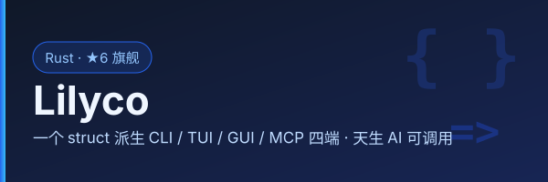

<p align="center">
  
</p>

<div align="center">
  
</div>

# Lilyco

**One struct. Four interfaces (CLI / TUI / Web / MCP). Zero boilerplate. Cross-platform (Windows / Linux / Android).**

**Mission — Accelerate the arrival of Token 2 Anything, promote its adoption, enhance the liquidity of intelligence in the real world, liberate humans, and hasten the arrival of the lying-flat future.**

[](LICENSE)
[](https://www.rust-lang.org)
[](https://github.com/lilyco-42/lilyco/actions)
[](https://github.com/lilyco-42/lilyco/releases)
[](https://github.com/lilyco-42/lilyco)
[](https://crates.io/crates/lilyco) [](https://crates.io/crates/lilyco-core) [](https://crates.io/crates/lilyco-mcp) [](https://docs.rs/lilyco)

Lilyco is a Rust framework that generates **CLI**, **TUI**, **Web UI**, and a **standard MCP server** — from a single struct definition. Every app is an AI tool by default: agents (DeepSeek Harness, Claude Code, Cursor…) call it directly through MCP or JSON-stream. Same binary runs on Windows, Linux, and Android (Termux). You write the business logic once; the framework handles everything else.

---

## Table of Contents

- [Why Lilyco](#why-lilyco)
- [Quick Start](#quick-start)
- [Architecture](#architecture)
- [Codegraph (for AI agents)](docs/CODEGRAPH.md)
- [Crate Reference](#crate-reference)
  - [lilyco-core](#lilyco-core)
  - [lilyco-macros](#lilyco-macros)
  - [lilyco-cli](#lilyco-cli)
  - [lilyco-tui](#lilyco-tui)
  - [lilyco-gui](#lilyco-gui)
  - [lilyco (facade)](#lilyco-facade)
  - [lilyco-mcp](#lilyco-mcp)
  - [lilyco-ultra-ui](#lilyco-ultra-ui)
- [Type -> Widget Mapping](#type---widget-mapping)
- [AI Integration](#ai-integration)
- [Progress Protocol](#progress-protocol)
- [Examples](#examples)
- [DSH Integration](#dsh-integration)
- [Testing](#testing)
- [Installation](#installation)
- [Limitations & Roadmap](#limitations--roadmap)

---

## Why Lilyco

A typical Rust CLI tool needs about 200 lines of clap boilerplate before the first line of actual logic. Add a TUI? Another 400 lines. A web dashboard? A different codebase entirely. Want LLMs to call your tool? You're writing JSON Schema by hand.

Lilyco collapses all of this into a single `#[derive]`:

```rust
#[derive(App)]
#[app(about = "Compress image files", run = "compress")]
struct ImgCompress {
    #[arg(about = "Input file", must_exist = true)]
    input: PathBuf,

    #[arg(about = "Quality 1-100", default = 75, range = 1..=100)]
    quality: u8,

    #[arg(about = "Output format", default = "jpeg")]
    format: Format,

    #[arg(about = "Dry run")]
    dry_run: bool,
}
```

From this you get:

- `imgpress --input photo.jpg --quality 50 --format webp` — CLI
- Interactive TUI form with live command preview — TUI
- Browser-based form with SSE progress — Web
- Valid Anthropic/OpenAI tool definition — AI
- **`imgpress --mcp`** — a standard MCP server any Agent can call (2024-11-05)

Same binary, four interfaces — the backend is chosen automatically by the environment.

---

## Quick Start

Create a new project and add the dependencies:

```bash
cargo new imgpress && cd imgpress
cargo add lilyco serde serde_json image      # 一个框架依赖即可（宏经 facade 解析路径）
```

Paste this into `src/main.rs`:

```rust
use std::path::PathBuf;
use std::time::Instant;
use image::{DynamicImage, GenericImageView};
use image::imageops::FilterType;
use lilyco::prelude::*;

// 1. Define your types
#[derive(Debug, ValueEnum)]
enum Format { Jpeg, Png, Webp }

#[derive(App)]
#[app(about = "Compress image files", run = "compress")]
struct ImgCompress {
    #[arg(about = "Input image", must_exist = true)]
    input: PathBuf,

    #[arg(about = "Quality 1-100", default = 75, range = 1..=100)]
    quality: u8,

    #[arg(about = "Output format", default = "jpeg")]
    format: Format,

    #[arg(about = "Max width, 0 = no resize")]
    width: u32,

    #[arg(about = "Dry run")]
    dry_run: bool,
}

// 2. Write your business logic
fn compress(app: &ImgCompress, ctx: &Context) -> Result<serde_json::Value, AppError> {
    let start = Instant::now();
    ctx.emit(Progress::Started { total: Some(3), message: None });

    let data = std::fs::read(&app.input)?;
    let img = image::load_from_memory(&data)
        .map_err(|e| AppError::Runtime(format!("decode: {e}")))?;

    ctx.tick(1, Some(3), "Resizing...");
    let img = if app.width > 0 && app.width < img.width() {
        let ratio = app.width as f64 / img.width() as f64;
        let h = (img.height() as f64 * ratio) as u32;
        img.resize_exact(app.width, h.max(1), FilterType::Lanczos3)
    } else { img };

    ctx.tick(2, Some(3), "Encoding...");
    let out_path = app.input.with_file_name(format!("compressed.{}",
        if matches!(app.format, Format::Jpeg) { "jpg" } else { "png" }));
    img.save(&out_path).map_err(|e| AppError::Runtime(format!("save: {e}")))?;

    ctx.tick(3, Some(3), "Done");
    ctx.done(serde_json::json!({"output": out_path.to_string_lossy()}),
             start.elapsed().as_millis() as u64);
    Ok(serde_json::json!({"status": "ok"}))
}

// 3. Wire up — one line, four interfaces
fn main() {
    lilyco::run::<ImgCompress>();
}
```

Run it:

```bash
$ cargo run -- --input photo.jpg --quality 50 --format webp
$ cargo run -- --schema              # JSON Schema
$ cargo run -- --anthropic-tool      # AI tool definition
$ cargo run -- --json-stream         # Machine-readable progress
$ cargo run -- --gui                 # Web GUI (SSE progress)
$ cargo run -- --mcp                 # MCP stdio server (Agent-ready)
```

`lilyco::run::<A>()` 按环境自动选端（借鉴 mininterface 的接口工厂）：
交互终端 → TUI；管道/脚本 → CLI；`--gui` → Web；`--mcp` → MCP。
TUI 起不来时自动回退 CLI，绝不裸崩。

---

## Architecture

高内聚低耦合：执行语义只存在于 core（`executor`），四个后端只做"渲染/传输"，
门面 `lilyco` 是唯一的组合根（依赖所有后端），用户只依赖 `lilyco`。

```
+----------------------------------------------------------+
|              Your Struct  #[derive(App)]                  |
+----------------------------------------------------------+
                  |
     lilyco (facade)：自动后端选择（显式参数 > LILYCO_UI > 探测）
                  |
   +--------------+----------------+----------------+-----+
   |  lilyco-cli |  lilyco-tui    |  lilyco-gui    | lilyco-mcp
   |   clap      |  ratatui 表单  |  axum + SSE    | stdio JSON-RPC
   |             |                |                | tools/list·call
   +--------------+----------------+----------------+-----+
                  |                  |
      +-----------v------------------v-----------------+
      |              lilyco-core                        |
      |  App trait · CommandSchema · Registry(别名/隐藏) |
      |  executor（唯一执行宿主：参数→执行→进度事件）     |
      |  Progress 协议 · Context · AppError              |
      +--------------------------------------------------+
```

### Design Principles

1. **Type-driven**: `bool` -> checkbox, `u8` -> number input, custom enum -> dropdown. No manual widget mapping.
2. **CLI-first**: CLI is the most structured interface. TUI and Web are derived from the same schema.
3. **Progress as first-class citizen**: Every interface understands `Progress::Tick` / `Log` / `Done`.
4. **One execution host**: `core::executor` 是唯一的"参数→执行→进度事件"实现，
   CLI / TUI / GUI / MCP 只渲染事件流，不再各自实现宿主循环（消灭了三份重复代码）。
5. **AI-native**: 导出 LLM function-calling schema + 标准 MCP 服务器（`--mcp`），Agent 直接调用。
6. **Facade 自动选端**: 借鉴 mininterface 的接口工厂 —— 显式参数 > `LILYCO_UI` > 自动探测，
   TUI 起不来回退 CLI。
7. **Registry 动态注册**: 借鉴 unilang —— 运行期注册命令（插件 / AI 动态注册 / REPL），
   声明式 JSON 加载（`Registry::register_from_json`）。

---

## Crate Reference

### lilyco-core

The foundation. No UI dependencies.

```rust
use lilyco_core::prelude::*;
```

#### Core Traits

| Trait | Method | Purpose |
|-------|--------|---------|
| `App` | `schema() -> CommandSchema` | Returns the full command schema |
| `App` | `from_args(&HashMap) -> Result<Self, AppError>` | Construct from parsed CLI/AI args |
| `App` | `run(&self, &Context) -> Result<Value, AppError>` | Execute business logic |
| `Renderer` | `render(&self, &CommandSchema) -> Output` | Convert schema to a UI representation |
| `ValueEnum` | `variants() -> Vec<&str>` | All possible string values |
| `ValueEnum` | `from_str(&str) -> Option<Self>` | Parse from string |

#### Core Types

| Type | Purpose |
|------|---------|
| `CommandSchema` | Full command description: name, about, args, subcommands |
| `ArgSchema` | Single argument: name, about, kind, required, default |
| `ArgKind` | `Flag | Text | Number {min,max} | Enum {values} | Path {must_exist} | List {item}` |
| `Progress` | `Started | Tick | Log | Done | Error` |
| `LogLevel` | `Debug | Info | Warn | Error` |
| `Context` | Runtime: progress channel, cancel signal, output format |
| `OutputFormat` | `Human | Json | JsonStream` |
| `AppError` | `InvalidArg | InvalidInput | Runtime | Cancelled | Io | Serialize` |
| `Registry` | 运行期命令注册表：注册 / 别名 / 隐藏 / JSON 声明式加载 |
| `RegisteredCommand` | `name + aliases + hidden + schema + handler` |
| `Handler` | `Fn(&Context, &Value) -> Result<Value, AppError>`（统一执行入口） |
| `executor` | 共享执行宿主：`spawn`（流式）/ `execute`（同步收集），保证事件流以 Done/Error 结尾 |

#### CommandSchema JSON Export

```rust
schema.to_json_schema()       // JSON Schema (generic)
schema.to_openai_tool()       // OpenAI function calling format
schema.to_anthropic_tool()    // Anthropic tool use format
```

### lilyco-macros

Proc macros for deriving boilerplate.

```rust
use lilyco_macros::{App, ValueEnum};
```

#### `#[derive(App)]`

Generates `schema()`, `from_args()`, and `run()`. Reads these attributes:

**Struct-level:**
| Attribute | Example | Purpose |
|-----------|---------|---------|
| `#[app(about = "...")]` | `#[app(about = "Compress images")]` | Command description |
| `#[app(run = "fn")]` | `#[app(run = "compress")]` | Wire up `run()` to a business-logic function |

**Field-level:**
| Attribute | Example | Purpose |
|-----------|---------|---------|
| `#[arg(about = "...")]` | `#[arg(about = "Input file")]` | Argument description |
| `#[arg(default = expr)]` | `#[arg(default = 75)]` | Default value |
| `#[arg(range = lo..=hi)]` | `#[arg(range = 1..=100)]` | Number range |
| `#[arg(min = n)]` | `#[arg(min = 0)]` | Min value |
| `#[arg(max = n)]` | `#[arg(max = 255)]` | Max value |
| `#[arg(must_exist = bool)]` | `#[arg(must_exist = true)]` | Path existence check |

#### `#[derive(ValueEnum)]`

Auto-converts PascalCase variants to snake_case strings:

```rust
#[derive(ValueEnum)]
enum Codec { H264, H265, Av1 }
// -> variants: ["h264", "h265", "av1"]
// -> from_str("h265") -> Some(Codec::H265)
```

#### Type Inference

| Rust Type | Inferred `ArgKind` | `required` |
|-----------|-------------------|------------|
| `bool` | `Flag` | `false` |
| `String` | `Text` | `true` |
| `u8`/`i32`/`f64`/... | `Number` | `true` |
| `PathBuf` | `Path` | `true` |
| `Option<T>` | same as `T` | `false` |
| `Vec<T>` | `List { item: infer(T) }` | `true` |
| Custom `enum` | `Enum` | `true` |

### lilyco-cli

Generates a `clap::Command` from `CommandSchema`. Adds built-in flags automatically.

```rust
let schema = MyTool::schema();
let renderer = lilyco_cli::CliRenderer::new();
let cmd = renderer.render(&schema);
let matches = cmd.get_matches();
```

#### Built-in Flags (auto-added to every command)

| Flag | Behavior |
|------|----------|
| `--schema` | Print JSON Schema and exit |
| `--openai-tool` | Print OpenAI function definition and exit |
| `--anthropic-tool` | Print Anthropic tool definition and exit |
| `--json` | OutputFormat::Json |
| `--json-stream` | OutputFormat::JsonStream (one JSON per line) |

#### Public API

```rust
impl CliRenderer {
    fn new() -> Self;
    fn render(&self, schema: &CommandSchema) -> clap::Command;
    fn handle_builtin_flags(schema: &CommandSchema, matches: &ArgMatches) -> bool;
    fn output_format(matches: &ArgMatches) -> OutputFormat;
    fn extract_args(schema: &CommandSchema, matches: &ArgMatches)
        -> HashMap<String, serde_json::Value>;
}
```

#### 多命令（Registry → clap 子命令）

一个二进制挂多个命令，子命令名 / 别名 / 隐藏语义全部来自 `Registry`：

```rust
let mut registry = Registry::new();
registry.register(RegisteredCommand::from_app::<Compress>())?;
registry.register(RegisteredCommand::from_app::<Resize>())?;

lilyco_cli::run_registry("imgtool", registry);   // crate 入口
lilyco::run_cli_registry("imgtool", registry);   // 门面入口
```

```bash
imgtool compress --input a.png    # 子命令
imgtool resize --width 800        # 子命令
imgtool --schema                  # 注册表清单（全部命令 schema，Agent 可消费）
```

> `#[derive(App)]` 默认用结构体名做命令名；多命令场景建议
> `#[app(name = "img-compress")]` 指定 kebab-case 名。

### lilyco-tui

Interactive terminal form built on ratatui.

```
 Transcode -- Transcode video files
 $ transcode --input video.mp4 --codec h265 --quality 18
---------------------------------------------------------
          (*) input: [video.mp4________________________]
              codec: [h264] h265 [Av1]                  <->
           quality: [18]                                ^v
           dry_run: [x]                                 Space
---------------------------------------------------------
 [Tab] Switch  [Enter] Confirm  [Esc] Quit  [F1] Help
```

#### Widget Behaviors

| ArgKind | Key | Behavior |
|---------|-----|----------|
| Flag | `Space` | Toggle on/off |
| Text | Type + `Backspace` | Edit text |
| Number | `^` `v` | +/-1（自动夹在 schema 范围内）. Type digits to edit（越界由提交校验拦截） |
| Enum | `<` `>` | Cycle through options |
| Path | Type + `Tab` | **目录补全**：循环候选（目录带 `/` 后缀）；空值时 `Tab` 切换字段 |
| List | `Enter` / `Delete` | Add/remove item |

#### State Machine

```
[多命令] CommandSelect --Enter--> Form --Enter--> Confirm --Enter--> Running --done--> Done
                                          ^                   |               |
                                          |                   |               |
                                          +------<--- Done/Error 任意键返回（单命令退出）
  ^               |                   |               |
  |               Esc                 |               |
  +---------------+                   v               v
                                   Error <---------- Enter
```

#### CLI Preview

The bottom bar shows a live CLI command preview that updates as you edit values. It auto-omits:

- `false` flags (e.g., `--dry-run` only appears when checked)
- Values matching their defaults
- Empty optional fields
- Path values are auto-quoted if they contain spaces

### lilyco-gui

Web server with embedded HTML, similar to Gradio in spirit. Zero external UI dependencies: one
self-contained page (design tokens, component catalogue and the seven interaction states live in
`lilyco-gui/DESIGN.md`), light + dark, usable from 320 px to 1920 px.

```rust
// 单命令：把 App 类型交给它，进度与取消都接好线（内部就是一份单命令注册表）
let gui = lilyco_gui::GuiRenderer::new(8080);
gui.serve_app::<ImgCompress>(ImgCompress::schema()).await;
```

多命令用 `serve_registry(registry)`（页面顶部出现命令下拉，`?cmd=` 切换）。自己实现执行体的逃生口是
`serve(schema, runner)`：`RunnerFn` 拿到参数和一个 SSE 发送端，代价是 GUI 手里没有取消句柄，
页面因此不画「取消」按钮 —— 要让 Web 端能取消就走前两个入口。

```
+-------------------------------------+
|  ◆ lilyco Web 控制台     [imgcompress v] ◐ |
|  ImgCompress                        |
|  Compress images                    |
|  Input *  [_____________________]   |
|           [ ⇪ 拖拽区 · 选择文件 · 本机 ] |
|  Quality  [75]  取值 1 – 100        |
|  Format   [jpeg v]                  |
|  Dry run  [ ]  只算不写             |
|  [▶ 运行] [■ 取消] [复制 CLI]        |
|  $ imgcompress --quality 75 ...     |
|  输出  ▓▓▓▓▓▓░░░░ 60%                |
|  > Encoding frame 60/100            |
|  结果  { "saved_bytes": 10240 }  [复制] |
+-------------------------------------+
```

**Flow:** `POST /run` (JSON args + token header) → spawn on `core::executor` → `GET /progress/{sid}`
SSE (`started` / `tick` / `log` / `telemetry` / `done` / `error`) → progress bar + log + result.

**路径字段带「本机」选择按钮**：`#[arg(must_exist = true)]` 渲染出的输入框旁边有一个按钮，点了由**本机进程**弹一次系统文件选择框（`POST /pick`，走 `rfd`，可用 `pick` 特性关掉），选完把真实路径回填进输入框。
浏览器的 `<input type=file>` 办不到这件事——它出于安全永远不给出真实路径（只有 `File.name`），而四端共用的 handler 收的正是 `path`、自己从盘上读。
`/pick` 与 `/run` 共用同一道回环 + Origin + Token 闸（无令牌 401，挡在弹框之前）；对话框在 blocking 线程里等，弹着的时候页面照常响应。
> 弹框可见性：Windows 的前台锁定不让后台进程抢焦点，所以 `pick_handler` 不硬抢——它按标题轮询
> `FindWindowW`（标题就是 `set_title` 用的那个常量，两者不会各说各话），`SetForegroundWindow` 试一次、
> `FlashWindowEx` 让任务栏那一格闪起来；页面上同时挂一条「系统选择框已弹出，可能被压在后面，看任务栏」的提示，
> 请求一结束就撤。实测：弹着的时候 `tasklist /V` 的窗口标题正是 `选择文件`，且页面其他请求仍然 200。

### lilyco (facade)

**一个依赖搞定四端**。用户代码只依赖这一个 crate，后端按环境自动选择。

```rust
use lilyco::prelude::*;

fn main() {
    lilyco::run::<ImgCompress>();          // 自动选端
    // lilyco::run_with::<ImgCompress>(Backend::Mcp);  // 显式指定
}
```

| 触发方式 | 后端 |
|---------|------|
| `--mcp` | MCP stdio 服务器（Agent 直接调用） |
| `--gui` / `--web` | Web GUI |
| `LILYCO_UI=cli\|tui\|web\|mcp` | 环境变量强制 |
| 交互终端 + `TERM` | TUI 表单（起不来自动回退 CLI） |
| 其余（管道 / CI / 脚本） | CLI（`--json-stream` 供 AI 消费） |

多命令场景（Registry → 四端导航）：

```rust
lilyco::serve_mcp(registry);         // MCP：整个注册表 = tools/list
lilyco::run_cli_registry("app", registry);   // CLI：注册表 → clap 子命令
lilyco::run_tui_registry("app", registry);   // TUI：命令选择页 → 表单（回退 CLI）
```

| 触发方式（单命令） | 后端 |
|---------|------|
| `--mcp` | MCP stdio 服务器（Agent 直接调用） |
| `--gui` / `--web` | Web GUI |
| `LILYCO_UI=cli\|tui\|web\|mcp` | 环境变量强制 |
| 交互终端 + `TERM` | TUI 表单（起不来自动回退 CLI） |
| 其余（管道 / CI / 脚本） | CLI（`--json-stream` 供 AI 消费） |

### lilyco-mcp

把命令注册表暴露为标准 **Model Context Protocol** 服务器（2024-11-05），
实现 `initialize` / `ping` / `tools/list` / `tools/call`，零额外依赖。
`tools/call` 携带 `_meta.progressToken` 时，执行期间流式返回
`notifications/progress`（Progress::Started/Tick → 通知），长任务对 Agent 不再是黑盒。

```rust
let mut registry = Registry::new();
registry.register(RegisteredCommand::from_app::<MyTool>())?;
lilyco_mcp::McpServer::new(registry).serve_stdio()?;
```

核心是纯函数 `handle_line`（一行请求 → 一行响应），`serve` 可挂任意 `Read + Write`，
协议逻辑全部可单元测试。

### lilyco-ultra-ui

Experimental **JSON-to-React** declarative UI generator. Write a Chinese-language JSON spec; get a full React frontend — no Rust code required.

```rust
use lilyco_ultra_ui::UltraUiServer;

#[tokio::main]
async fn main() {
    UltraUiServer::new(9090).serve().await;
}
```

The JSON spec uses Chinese field names for an Excel-like feel:

```json
{
  "窗口": {
    "标题": "My App",
    "大小": "中等",
    "元素": [
      { "类型": "标题", "内容": "Welcome" },
      { "类型": "文本输入", "标签": "Name", "占位符": "Enter name..." },
      { "类型": "数字", "标签": "Quantity", "最小值": 0, "最大值": 100 },
      { "类型": "按钮", "文本": "Submit", "样式": "primary" },
      { "类型": "进度", "标签": "Progress" }
    ]
  }
}
```

#### Supported Element Types

| Type (Chinese) | English | Description |
|----------------|---------|-------------|
| `文本` | Text | Static text block |
| `标题` | Heading | H1-H4 heading |
| `按钮` | Button | Clickable button with style variants |
| `文本输入` | Text Input | Single-line text input |
| `数字` | Number | Numeric input with min/max |
| `下拉` | Select | Dropdown select |
| `复选框` | Checkbox | Boolean toggle |
| `多行文本` | Textarea | Multi-line text input |
| `图片` | Image | Image display |
| `分割线` | Divider | Visual separator |
| `进度` | Progress | Progress bar |
| `链接` | Link | Hyperlink |
| `计算器` | Calculator | Built-in calculator widget |

---

## Type -> Widget Mapping

| Rust Type | CLI | TUI | Web |
|-----------|-----|-----|-----|
| `bool` | `--flag` | `[x]` Space toggle | `<input type=checkbox>` |
| `String` | `--name <val>` | text input | `<input type=text>` |
| `u8`/`i32`/`f64`/... | `--count <num>` | ^v +/-1 + digit input | `<input type=number>` |
| Custom enum | `--mode <choice>` | <-> cycle | `<select>` |
| `PathBuf` | `--file <path>` | text input | `<input type=text>` |
| `Vec<T>` | `--tag a --tag b` | Enter/Delete multi-line | dynamic inputs |
| `Option<T>` | optional | optional (not required) | optional |

---

## AI Integration

Every Lilyco app is an AI tool:

```bash
$ imgpress --anthropic-tool
```

```json
{
  "name": "ImgCompress",
  "description": "Compress image files",
  "input_schema": {
    "type": "object",
    "properties": {
      "input": { "type": "string", "description": "Input image file" },
      "quality": { "type": "number", "minimum": 1, "maximum": 100, "description": "Quality" },
      "format": { "type": "string", "enum": ["jpeg", "png", "webp"], "description": "Format" },
      "dry_run": { "type": "boolean", "description": "Dry run" }
    },
    "required": ["input"]
  }
}
```

This is a valid Anthropic tool-use definition. Drop it into your Claude API call, and the model can invoke your Rust tool directly.

```bash
$ imgpress --openai-tool             # Chat Completions 格式（嵌套 function）
$ imgpress --openai-responses-tool   # Responses API 格式（扁平，strict:false）
$ imgpress --openai-strict-tool      # strict mode（结构化输出：剥约束关键词 +
                                     #   additionalProperties:false + 全字段 required）
$ imgpress --gemini-tool             # Gemini functionDeclarations（OpenAPI 子集）
$ imgpress --anthropic-tool          # Anthropic tool_use
$ imgpress --schema                  # Generic JSON Schema (for other LLMs)
$ imgpress --mcp            # 标准 MCP 服务器：Agent 直接调用（含进度通知）
```

更进一步 —— **采样桥**（`HostBridge`）：MCP 形态下，工具执行中途可以反向调用
Agent 客户端的 LLM（`sampling/createMessage`），让"工具用上模型"而不只是
"模型用工具"：

```rust
fn run(app: &VisionTool, ctx: &Context) -> Result<serde_json::Value, AppError> {
    let caption = ctx.sample("描述这张图片的内容", 256)?;   // 反向采样
    ctx.done(serde_json::json!({ "caption": caption }), 0);
    Ok(serde_json::Value::Null)
}
```

客户端未声明 `sampling` 能力时返回带指引的错误（审批权始终在客户端手里）。
$ imgpress --json-stream    # Each Progress event as one JSON line — ideal for agent consumption
```

### MCP Server（AI 调用的事实标准）

```bash
$ imgpress --mcp
```

`lilyco-mcp` 把命令注册表暴露为标准 **MCP stdio 服务器**（协议 2024-11-05）。
任何支持 MCP 的 Agent（Claude Desktop、Cursor、OpenHands 等）都可以直接调用你的 Rust 工具：

```json
{"jsonrpc":"2.0","id":1,"method":"initialize","params":{}}
{"jsonrpc":"2.0","id":2,"method":"tools/list"}
{"jsonrpc":"2.0","id":3,"method":"tools/call","params":{"name":"ImgCompress","arguments":{"input":"photo.jpg","quality":50}}}
```

相比手写 `--anthropic-tool` / `--openai-tool` 单次 schema，MCP 是标准化的长连接协议，
一次 `tools/list` 拿全量工具定义，`tools/call` 直接执行并返回结构化结果。

### AI Agent Consumption Pattern

```jsonl
{"type":"started","total":5,"message":"Loading photo.jpg..."}
{"type":"tick","current":1,"total":5,"message":"Reading input file","percent":0.2}
{"type":"tick","current":2,"total":5,"message":"Original: 4000x3000","percent":0.4}
{"type":"tick","current":3,"total":5,"message":"Encoding...","percent":0.6}
{"type":"tick","current":4,"total":5,"message":"Writing compressed.jpg","percent":0.8}
{"type":"done","result":{"output_size":142000,"compression_ratio":35.5},"duration_ms":1200}
```

---

## Progress Protocol

Every interface consumes the same `Progress` events:

```rust
ctx.emit(Progress::Started { total: Some(100), message: Some("Starting...".into()) });

for i in 0..=100 {
    if ctx.is_cancelled() { return Err(AppError::Cancelled); }
    ctx.tick(i, Some(100), format!("Processing frame {i}"));
}

ctx.log(LogLevel::Info, "Compression complete");
ctx.done(serde_json::json!({"size_mb": 4.2}), 3200);
```

| Interface | `Started` | `Tick` | `Log` | `Done` |
|-----------|-----------|--------|-------|--------|
| **CLI** (`--json-stream`) | JSON line | JSON line with percent | JSON line | JSON line + exit |
| **CLI** (Human) | -- | `\r` progress line | `[INFO]` line | summary + exit |
| **TUI** | Progress bar at 0% | Bar fills + message | Scroll log | Result screen |
| **Web** | SSE: bar at 0% | SSE: bar fills | SSE: log append | SSE: result JSON |

---

## Examples

### Image Compressor (`lilyco-example`)

```bash
cd lilyco-example
cargo run -- --input photo.jpg --quality 50 --format webp
cargo run -- --input photo.jpg --dry-run --json
cargo run -- --schema
```

See `lilyco-example/src/main.rs` for the full source (~230 lines).

### Grep (`lilyco-grep`)

Simple recursive grep — the DSH ecosystem test vehicle:

```bash
cargo run -p lilyco-grep -- --pattern hello --path src
cargo run -p lilyco-grep -- --pattern TODO --path . --ignore-case --count
cargo run -p lilyco-grep -- --pattern hello --path src --json-stream   # AI 消费
cargo run -p lilyco-grep -- --pattern hello --path src --mcp           # MCP 服务器
```

### Brush (`lilyco-brush`)

brush（bash 兼容 shell）用 lilyco 重写 —— 给 AI 的 shell 工具：

```bash
lbrush --command "x=1; echo $x; ls | wc -l"        # CLI
lbrush --command "sleep 5" --timeout-secs 1        # 超时 kill
lbrush --command "ls" --json-stream                # AI 消费（JSONL）
lbrush --mcp                                      # MCP 服务器
```

- 每次调用全新 shell（`--no-config`），非零退出码不是工具错误（结构化返回 `exit_code`）
- DSH 接入：`lilyco-brush/dsh/cordis.patch.yml`（dsh-mcp-client stdio 直连，模型看到 `mcp__lbrush__Brush`）
- CI 产出 `lbrush-windows` artifact，本机不装 Rust 也能拿二进制

#### Android（Termux）

lbrush 跨平台，Android 用 headless 构建（CLI + MCP）：

```bash
# CI artifact：lbrush-android-arm64；或本地交叉编译：
cargo build -p lilyco-brush --no-default-features --features android --target aarch64-linux-android
```

- headless 关掉 TUI/Web 后端（crossterm 的 `cfg(unix)` 不含 android；`lilyco` facade 按 feature 门控）
- shell 解析自动命中 Termux bash（`/data/data/com.termux/files/usr/bin/bash`）
- Termux 里直接跑：`./lbrush --command "echo hi"`，或 `./lbrush --mcp` 给 AI agent 连

### Vision Toolkit (`lilyco-vision`)

DSH Vision Toolkit 的 Rust 重写 —— 8 个本地视觉操作，`Registry` 注册 + `--mcp` 给 DSH 提供视觉：

```bash
lvision --list                                     # 打印全部工具 schema
lvision --mcp                                      # MCP 服务器（8 个原生工具）
```

| 工具 | 功能 | 依赖 |
|---|---|---|
| `ImageInfo` | 尺寸 / 格式 / 大小 | image |
| `Crop` | 像素框裁剪 + 缩放（LANCZOS） | image |
| `Resize` | 等比缩放 | image |
| `DominantColors` | 主色提取（贪心聚类 + 容差） | image（自研算法） |
| `PixelDiff` | 网格级像素差异排行 + 热力图 | image（自研算法） |
| `ExtractForeground` | 前景抠图（边界泛洪，透明 PNG） | image（自研算法） |
| `Trace` | 位图矢量化 → SVG | [vtracer](https://github.com/visioncortex/vtracer) |
| `HtmlScreenshot` | HTML → PNG（headless Chrome/Edge） | 浏览器 |

- 全部本地计算，无 Python 运行时（原版是 Pillow+numpy+vtracer 的 uv 环境）
- DSH 接入：`lilyco-vision/dsh/cordis.patch.yml`（模型看到 `mcp__lvision__*` 工具）
- CI 产物：`lvision-windows` / `lvision-android-arm64`
- 服务类工具（glance/ground/detect/OCR）依赖外部视觉服务，v1 不做

### FFmpeg Transcode (`lilyco-ffmpeg`)

`lffmpeg` —— ffmpeg 包装：转码 / 缩放 / 裁剪，实时进度 + 取消，四端 + AI 可调：

```bash
cargo install --path lilyco-ffmpeg                   # 源码安装（binstall 现在还拿不到，见下）
lffmpeg --input a.mp4 --output b.mp4 --codec h265 --crf 28   # CLI
lffmpeg --input a.mp4 --output b.mp4 --width 1280            # 缩放（高度自动等比）
lffmpeg --input a.mp4 --output clip.mp4 --start 10 --duration 5  # 裁剪
lffmpeg --input a.mp4 --output b.mp4 --json-stream          # AI 消费（JSONL 事件流）
lffmpeg --mcp                                              # MCP 服务器
```

- 实时进度：解析 ffmpeg `-progress pipe:1`；`ffprobe`（可选）算完成百分比，缺失降级不确定进度
- 取消：CLI `Ctrl-C`、TUI `Ctrl-C`/`c`/`q`/`Esc`，kill 正在运行的 ffmpeg
- 非零退出不是工具错误：结构化返回 `exit_code` + stderr 摘要
- **cargo binstall 现在还达不到**：`[package.metadata.binstall]` 写的是 `pkg-url = ".../v{ version }/{ name }-{ target }{ binary-ext }"`，而 binstall 的 `{ name }` 展开成**包名**（`lilyco-ffmpeg`）；打 tag 时 CI 发布的资产却按**二进制名**命名（`lffmpeg-x86_64-pc-windows-msvc.exe` / `lffmpeg-aarch64-linux-android`），URL 对不上 → 只会 404 再回退源码编译。改名放 CI 的 `Stage release files`（多拷一份包名命名的资产）最省事，两种改法与出处见 [`docs/INTEGRATION.md`](docs/INTEGRATION.md) §0
- 完整用法：见 [`docs/lffmpeg.md`](docs/lffmpeg.md)
- 依赖系统 `ffmpeg`（必须在 PATH 上）

### Binary structure (`lilyco-binfmt`)

`lbin` —— 回答「这个文件到底是什么结构」：识别 / 列成员 / 按区上色 / 读符号表，四端 + AI 可调，**4 条命令全 T0 只读**（不执行、不解压、不写盘）：

```bash
cargo install --path lilyco-binfmt                    # 从源码装（该 crate 还没上 crates.io，`cargo binstall` 要等发布 + 预编译资产）
lbin identify --path app.apk --json                   # 什么族什么格式 + 头部自报的字段
lbin entries  --path app.apk --limit 200              # 中央目录列出的成员（ZIP/tar/ar）
lbin regions  --path a.out --json                     # 头/表/代码/数据/空闲/尾部叠加
lbin symbols  --path /usr/bin/ls --json               # 节表 + .symtab/.dynsym + 地址→名字
lbin --mcp                                            # MCP 服务器
```

- 置信度分两档：`signature`（开头字节定死）与 `structural`（表刚好铺进文件才敢这么说）——`0xCAFEBABE` 既是 Java class 也是通用二进制，靠架构表落点判别
- 每个答案带自证：`entries` 报 `checks[]`（文件自报的数目/长度对不上就直说），`regions` 保证 `claimed + unreferenced + loaded_unaddressed == 读进来的字节数`
- `gap`（绿色）只表示「没有表点到这里」，不是「改这里安全」——校验和与签名不留痕迹
- 认不出签名、或该族的表还没实现，就 `mapped: false` + 原因，不编区间
- 完整用法：见 [`docs/binfmt.md`](docs/binfmt.md)

### Transcode (TUI demo)

```rust
use lilyco_macros::{App, ValueEnum};
use lilyco_core::prelude::*;
use std::path::PathBuf;

#[derive(ValueEnum)]
enum Codec { H264, H265, Av1 }

#[derive(App)]
#[app(about = "Transcode video files")]
struct Transcode {
    #[arg(about = "Input file", must_exist = true)]
    input: PathBuf,

    #[arg(about = "Codec", default = "h264")]
    codec: Codec,

    #[arg(about = "Quality 0-51", default = 23, range = 0..=51)]
    quality: u8,
}
```

### Ultra UI (`lilyco-ultra-ui-example`)

```bash
cargo run -p lilyco-ultra-ui-example
# Open http://localhost:9090 in your browser
```

Edit the JSON spec in the browser; the React UI updates in real time.

---

## DSH Integration

**DeepSeek Harness 接入（实测验证）**：lilyco 应用以 **MCP 服务器**形态挂进 dsh，模型直接获得原生工具。

### 原理

dsh 的能力扩展单元是 cordis 插件；外部 Rust 二进制经官方 [`@deepseek-ai/dsh-mcp-client`](https://github.com/deepseek-ai/deepseek-harness) 插件桥接（spawn 进程 + 注册 `ctx.tools`），模型看到 `mcp__<server>__<tool>` 原生工具。

### 一键接入

```bash
curl -fsSL https://raw.githubusercontent.com/lilyco-42/lilyco/HEAD/install.sh | bash
```

脚本自动：下载 release 二进制 → 安装 `dsh-mcp-client` 插件 → 写 profile patch。重启 dsh web 后，模型获得：

| 服务器 | 工具 |
|---|---|
| `mcp__lbrush` | `Brush`（真 bash 执行器：变量/管道/重定向/`&&`/`||`/if-for-while） |
| `mcp__lvision` | `Crop` / `Resize` / `DominantColors` / `PixelDiff` / `ExtractForeground` / `Trace` / `HtmlScreenshot` / `ImageInfo` |

### 已知坑（实测）

- **首轮不可见**：若 profile 使用了 router-flash 类 agent preset（首轮 core 工具过滤），新会话第一轮看不到 mcp 工具 —— 让模型先调用任意一次工具，下一轮全目录放开。
- 插件无 `dsh.bundle` 时是 plain dependency，patch insert 显式引用其 name 即可加载。
- 加/改插件后必须**重启 dsh web**（可用 `tasklist` 验证 `lbrush-windows.exe --mcp` 子进程确认插件已连接）。

## Testing

本地：

```bash
# Run all tests
cargo test --workspace

# Run a specific crate
cargo test -p lilyco-core
cargo test -p lilyco-cli
cargo test -p lilyco-tui
cargo test -p lilyco-macros
cargo test -p lilyco-ultra-ui
cargo test -p lilyco-mcp
cargo test -p lilyco-vision
```

CI（GitHub Actions）：push / PR 自动跑 **ubuntu + windows 双矩阵** —
`cargo fmt --check` + `cargo clippy --workspace --all-targets` + `cargo test --workspace` + `cargo doc`；
打 tag `v*` 自动构建 4 个二进制（Windows + Android-arm64）并发布 GitHub Release。
见 `.github/workflows/ci.yml`。Windows TUI 从此由 CI 持续验证编译与单元测试。

Current coverage: **241 tests** across all crates (ubuntu + windows 双平台) + 端到端冒烟（`examples/multi.rs`）+ 性能基准（`cargo bench -p lilyco-example`）.

---

## Installation

### From crates.io (published)

```toml
[dependencies]
lilyco = "0.2"            # 推荐：一个依赖搞定四端
# 默认 headless（CLI+MCP）；要 TUI/Web：lilyco = { version = "0.2", features = ["tui", "web"] }
lilyco-core = "0.2"       # derive(App) 宏展开需要
```

> **只写大版本。** `"0.2"` 是 caret 约束，会自动取到最新的 `0.2.x`；
> 精确版本号以页首那排 crates.io 徽章为准 —— 徽章是自动更新的，**不要在文档里写死 patch 号**，写死必然过期。
> 仓库 `main` 一般领先于已发布版本（workspace 里的版本号高于 crates.io 上的最新发布），
> 想用最新代码请走下面的「From git」。

### From git

```toml
[dependencies]
lilyco = { git = "https://github.com/lilyco-42/lilyco", rev = "9f04615905cb66a15cc9bd0859ad1e8f3cb2c7b3" } # git 依赖锁 rev（守则 2）
lilyco-core = { git = "https://github.com/lilyco-42/lilyco" }
```

---

## Limitations & Roadmap

### Current Limitations

- **`#[derive(App)]`** only works on named-field structs (no tuple structs or enums)
- **`#[app(run = "fn")]`** requires the function to be in scope. Without this attribute, `run()` panics with a helpful message directing you to add it.
- **Input validation** is shared: `CommandSchema::validate_args` (required / number range / enum / path must-exist) runs server-side in MCP (`INVALID_PARAMS`) and Web GUI (400), and pre-submit in TUI; CLI validates via clap at parse time
- **Subcommands** are supported in CLI only — TUI and Web renderers do not handle them yet
- **Ultra UI** is experimental — JSON spec format may change

### Roadmap

#### 已完成（v0.1 → v0.2.x）

- [x] ~~Real `run()` dispatch in Web GUI with progress streaming~~ — done via `GuiRenderer::serve_app::<A>()`
- [x] ~~`#[app(run = "fn")]` macro attribute~~ — wire business logic with zero boilerplate
- [x] ~~Integration tests that exercise all three interfaces end-to-end~~ — 12 tests in `lilyco-example`
- [x] ~~共享执行宿主~~ — `core::executor`，CLI/TUI/GUI/MCP 同一执行路径
- [x] ~~运行期命令注册表~~ — `core::Registry`（别名 / 隐藏 / JSON 声明式加载）
- [x] ~~MCP 输出面~~ — `lilyco-mcp`：`--mcp` 启动标准 stdio 服务器
- [x] ~~门面自动选端~~ — `lilyco::run::<A>()`（借鉴 mininterface 工厂）
- [x] ~~CI 双矩阵~~ — GitHub Actions ubuntu + windows：fmt / clippy / test / doc
- [x] ~~CLI 多命令：注册表 → clap 子命令~~ — `lilyco_cli::run_registry(name, registry)` / 门面 `lilyco::run_cli_registry`；隐藏命令可调用不显示，根级 `--schema` 打印注册表清单
- [x] ~~MCP 进度通知~~ — `tools/call` 携带 `_meta.progressToken` 时流式返回 `notifications/progress`（零依赖实现）
- [x] ~~MCP 采样 / roots~~ — 零依赖实现（不引 rust-sdk）：`HostBridge`（core）+ 双向 JSON-RPC 分流（serve）；handler 经 `ctx.sample()` 反向调用 Agent 的 LLM（`sampling/createMessage`），`ctx.roots()` 获取宿主工作根；客户端能力门控 + `srv-N` 字符串请求 id + 超时保护
- [x] ~~Subcommand navigation in TUI and Web GUI~~ — TUI 命令选择页（`TuiApp::new_multi` + `run_tui_registry`，mininterface subcommand picker 模式；隐藏命令不显示）；Web GUI `serve_registry` + `?cmd=` 切换下拉；`/run` 显式执行未知命令 400
- [x] ~~Input validation in TUI/Web widgets (range, required, enum)~~ — 共享校验 `CommandSchema::validate_args`：MCP `tools/call` 前置校验（`INVALID_PARAMS`）、Web GUI 服务端 400 + 浏览器 `required`/`min`/`max`、TUI 提交前拦截并红色提示；TUI 数字 ↑↓ 夹紧到 schema 范围
- [x] ~~TUI 执行异步化（进度渲染 + 取消）~~ — 非阻塞事件循环；取消键 `Ctrl-C`/`c`/`q`/`Esc`；executor 自动补发 `Done`/`Error` 终止事件（防卡死）
- [x] ~~Path auto-complete in TUI (Tab triggers directory listing)~~ — Path 字段有输入时 Tab 触发目录补全，重复 Tab 循环候选（目录带 `/` 后缀）；空值时 Tab 照常切换字段；兼容 `/` 与 `\` 分隔符
- [x] ~~`#[app(name = "...")]` macro attribute~~ — 多命令场景自定义 kebab-case 命令名（默认取结构体名）
- [ ] `#[app(subcommands)]` macro support
- [ ] TUI 执行异步化（进度渲染 + 取消）
- [x] ~~Publish to crates.io~~ — `lilyco-core/macros/cli/tui/gui 0.2.1`、`lilyco-mcp/lilyco 0.2.0`、`lilyco-ffmpeg 0.1.0`（旧 core 0.1.0/0.2.0 因缺 `executor`/`registry` 已 yank）
- [x] ~~Performance benchmarks for schema generation~~ — 零依赖基准 `cargo bench -p lilyco-example`（schema 生成 / JSON 导出 / validate_args / Registry 装配，release 实测 0.03–3 µs/op）

---

## License

MIT OR Apache-2.0, at your option.

